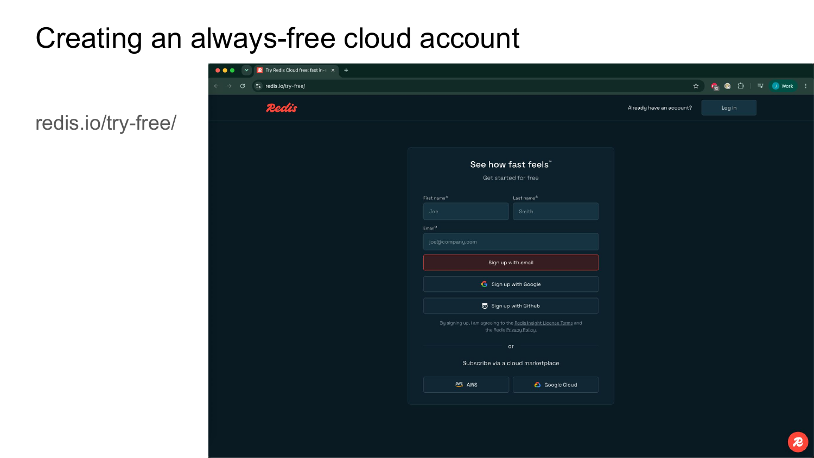
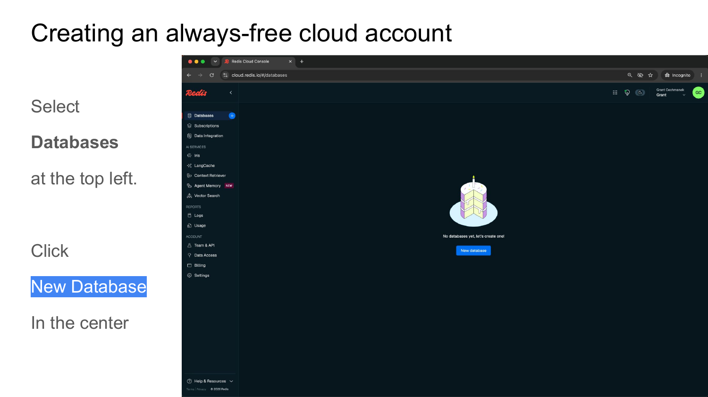
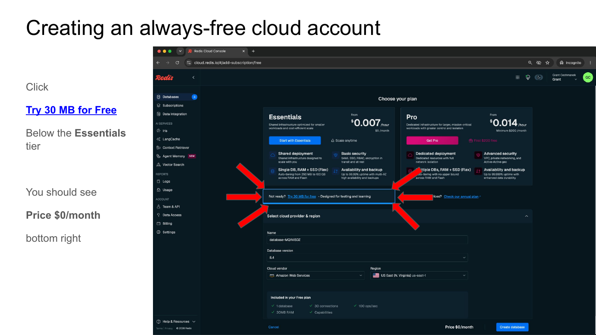
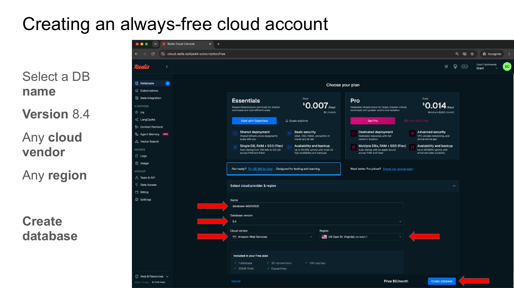
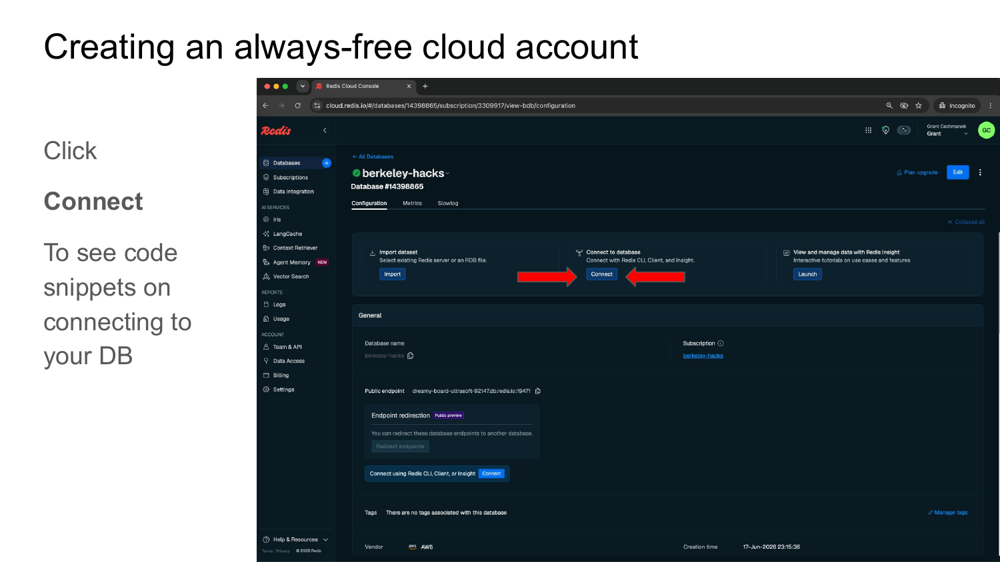
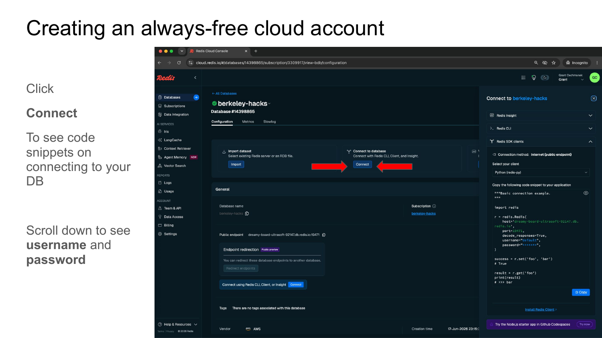
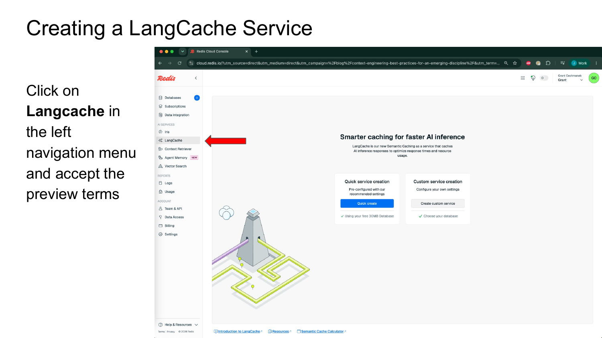
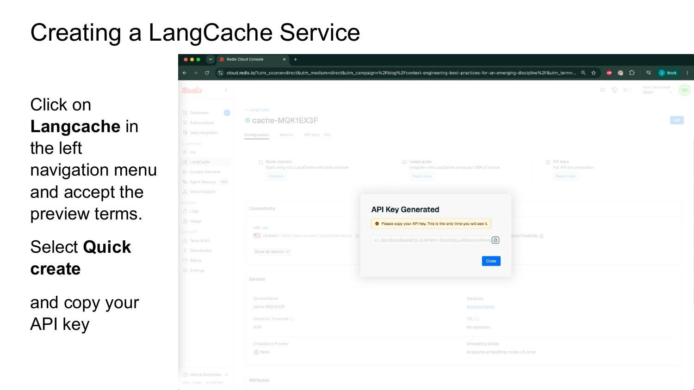
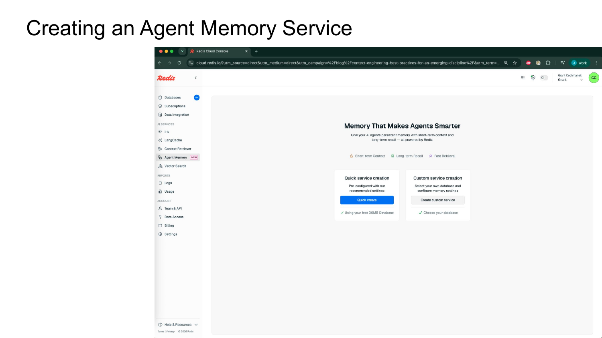
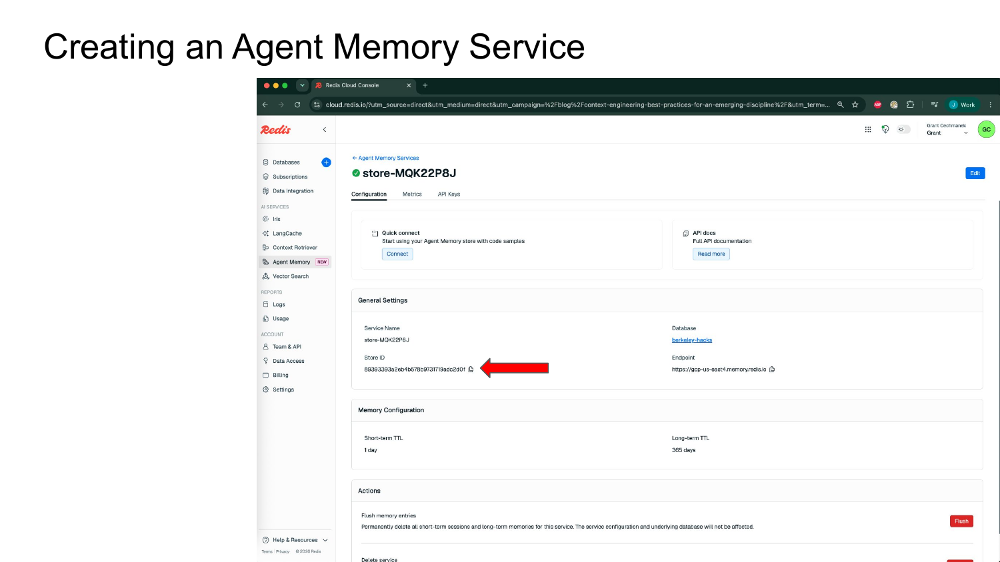

# Redis for AI — Berkeley AI Hackathon Workshop

> **Duration:** ~40 minutes &nbsp;|&nbsp; **Level:** beginner-friendly  
> **Repo:** https://github.com/justin-cechmanek/berkeley-ai-hackathon

In this workshop you'll build **Hack Buddy** — a knowledge-grounded AI chatbot powered entirely by Redis. You'll cover three Redis features that show up in almost every production AI app:

| Part | Feature | What it does |
|------|---------|-------------|
| 1 | **Vector Search** | Store and search a knowledge base by *meaning*, not keywords |
| 2 | **Semantic Cache** | Skip repeated LLM calls — instant answers for similar questions |
| 3 | **Agent Memory** | Give your chatbot persistent memory across conversation turns |

---

## Prerequisites

You'll need accounts and credentials for three services. Set them all up before opening the notebook.

- [OpenAI API key](https://platform.openai.com/api-keys)
- Redis Cloud database (free) — steps below
- LangCache service (free) — steps below
- Agent Memory service (free) — steps below

---

## Step 1 — Create a Free Redis Cloud Database

Redis Cloud gives you a free 30 MB database with Vector Search, JSON, and all the capabilities used in this workshop.

**Sign up at [redis.io/try-free](https://redis.io/try-free/)**



Once logged in, select **Databases** from the left navigation and click **New database**.



Click **Try 30 MB for Free** under the Essentials tier. Confirm the price shows **$0/month** in the bottom right.



Give your database a name, leave the version at **8.4**, pick any cloud vendor and region, then click **Create database**.



When the database is ready, click **Connect** to open the connection panel.



Select **Python (redis-py)** as your client. Copy the `host`, `port`, and `password` values — you'll need them for your `.env` file.



Your `REDIS_URL` will look like:
```
redis://default:<password>@<host>:<port>
```

---

## Step 2 — Create a LangCache Service

LangCache is Redis's semantic cache for LLM responses. It caches answers by *meaning*, so paraphrased questions get instant responses without hitting the LLM API.

In the Redis Cloud console, click **LangCache** in the left navigation and accept the preview terms.



Click **Quick create**. An API key will be generated — **copy it now**, as it's only shown once.



From the LangCache configuration page, note your:
- **Cache ID** (shown in the service name, e.g. `cache-MQK1EX3F`)
- **API key** (copied above)
- **Host** (shown in the configuration panel)

---

## Step 3 — Create an Agent Memory Service

Agent Memory gives your chatbot two layers of memory: short-term session history and long-term persistent facts — both backed by Redis.

In the Redis Cloud console, click **Agent Memory** in the left navigation and click **Quick create**.



After creation, the configuration page shows your **Store ID** and **Endpoint URL**.



Note your:
- **Endpoint** (e.g. `https://gcp-us-east4.memory.redis.io`)
- **Store ID** (shown in General Settings)
- **API key** (from the API Keys tab)

---

## Step 4 — Configure Your Environment

Create a `.env` file in the root of this repository. A template is provided at `.env.example`.

```bash
cp .env.example .env
```

Fill in all values:

```ini
# OpenAI
OPENAI_API_KEY="sk-proj-..."

# Redis Cloud — from Step 1
REDIS_HOST="<host>"
REDIS_PORT="<port>"
REDIS_USER="default"
REDIS_PASSWORD="<password>"

# LangCache — from Step 2
LANGCACHE_HOST="<host>"
LANGCACHE_CACHE_ID="<cache-id>"
LANGCACHE_API_KEY="<api-key>"

# Agent Memory — from Step 3
AGENT_MEMORY_URL="https://<your-endpoint>"
AGENT_MEMORY_STORE_ID="<your-store-id>"
AGENT_MEMORY_API_KEY="<your-api-key>"
```

---

## Step 5 — Run the Workshop Notebook

Install dependencies and open the notebook:

```bash
pip install -r requirements.txt   # or let the notebook's first cell handle it
jupyter notebook redis_ai_workshop.ipynb
```

Or open directly in [Google Colab](https://colab.research.google.com/github/justin-cechmanek/berkeley-ai-hackathon/blob/main/redis_ai_workshop.ipynb).

Run the cells in order. Each part builds on the previous one — by the end you'll have a fully working Hack Buddy chatbot.

---

## What You'll Build

```
 User message
      │
      ▼
 ① Semantic Cache ──HIT──► instant answer (no LLM call)
      │ MISS
      ▼
 ② Vector Search  ──────► retrieve relevant docs from Redis
      │
      ▼
 ③ Agent Memory   ──────► prepend conversation history
      │
      ▼
   LLM call  ──────────► answer
      │
      ▼
 store in memory + cache
```

---

## What to Build Next

You now have all three primitives. Some ideas for your hack:

- **Code Review Bot** — embed your codebase, answer questions about it, remember context across sessions
- **Event Recommender** — embed event descriptions, find what matches a user's vibe with vector search
- **Study Buddy** — RAG over lecture notes with long-term memory per student
- **Multi-Agent Orchestrator** — agents communicate via Redis Pub/Sub and store shared state in Redis JSON

---

## Repository Structure

```
berkeley-ai-hackathon/
├── redis_ai_workshop.ipynb   ← main workshop notebook
├── .env.example              ← credential template
├── images/                   ← setup guide screenshots
└── extras/
    ├── radish_bank_workshop.ipynb    ← bonus: banking AI demo
    └── redis-text-adventure/         ← bonus: multi-agent text game
```

---

## Resources

- [Redis AI docs](https://redis.io/docs/latest/develop/ai/)
- [RedisVL (vector library)](https://github.com/redis/redis-vl-python)
- [LangCache docs](https://redis.io/docs/latest/develop/ai/langcache/)
- [Agent Memory SDK](https://pypi.org/project/redis-agent-memory/)
- [Redis Cloud free tier](https://redis.io/try-free)
- [OpenAI API](https://platform.openai.com)

> **Need help?** Find us at the Redis booth or on Slack at #spons-redis
